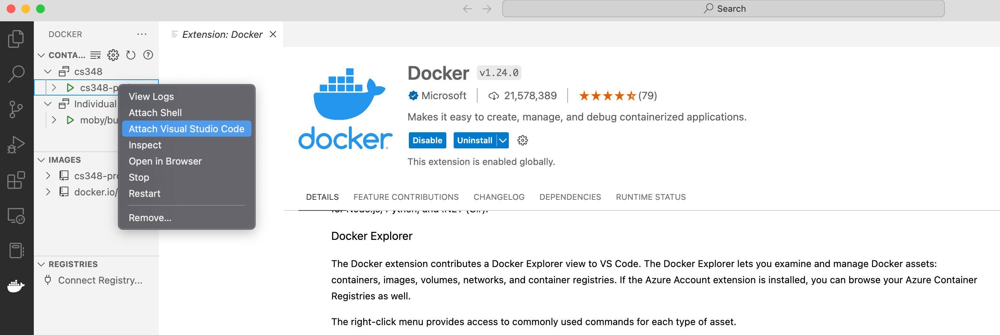

# CS348-OCaml-tutorial

## Purpose

- Easily setup Ocaml project!
- Don't waste time for project setup!
- Unify dev environment among team members!

## Getting started w/ Docker

1. Fork the following git repo: https://gitlab.com/jinho-choi123/cs348-ocaml-tutorial.git

2. Run the following command in your local
```
$ git clone <remote git repo url>
$ docker compose up -d
```

3. Attach visual studio code to the container.

4. Start your Project!

